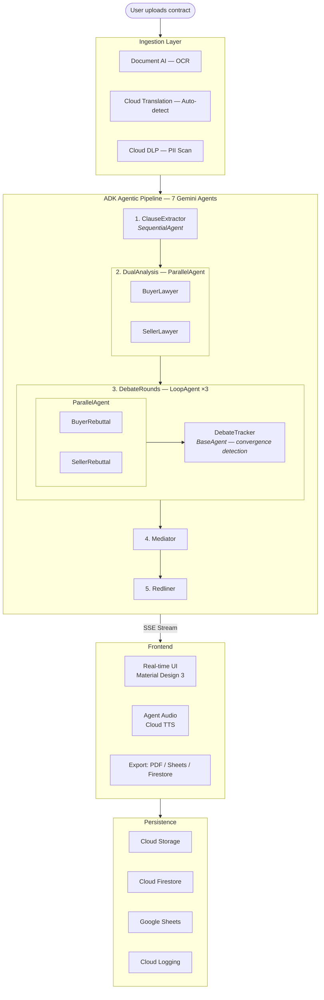

# Contract Negotiator

**Category: Agents**

A multi-agent contract analysis system where three AI lawyers — a buyer's attorney, a seller's attorney, and a neutral mediator — debate your contract in real time and deliver a structured risk assessment with suggested redlines.

Upload any contract (PDF, image, or pasted text) in any language. The system extracts clauses, runs dual-perspective legal analysis in parallel, conducts a 3-round adversarial debate with convergence detection, and produces a fairness-scored verdict with clause-by-clause revision recommendations.

## High-Level Architecture



## How the Agentic System Works

The core of this project is a **multi-agent pipeline** built on [Google's Agent Development Kit (ADK)](https://google.github.io/adk-docs/). ADK provides the orchestration primitives — we compose 7 specialized Gemini agents using 4 different ADK agent types to simulate a full legal negotiation.

### Why Multi-Agent?

A single LLM prompt cannot reliably argue both sides of a contract. It either hedges or picks a side. By assigning **separate agents with opposing instructions and perspectives**, each agent commits fully to its role. The adversarial structure surfaces risks that a single-pass analysis would miss — the buyer's attorney catches what benefits the seller, and vice versa. The mediator then has genuinely opposing arguments to weigh, producing a more balanced verdict.

### ADK Agent Types Used

We use all four ADK agent types, each for its natural purpose:

| ADK Type | Instance | Why This Type |
|----------|----------|---------------|
| **LlmAgent** | ClauseExtractor, BuyerLawyer, SellerLawyer, BuyerRebuttal, SellerRebuttal, Mediator, Redliner | Each is a single Gemini call with a specific role, instruction, and `output_schema` for validated JSON output |
| **SequentialAgent** | Root pipeline (`ContractNegotiator`) | The 5 stages must execute in order — each depends on the previous stage's state |
| **ParallelAgent** | `DualAnalysis` (buyer + seller lawyers), `ParallelRebuttals` (buyer + seller rebuttals) | These agent pairs have no dependency on each other within a stage — running them simultaneously cuts wall-clock time in half |
| **LoopAgent** | `DebateRounds` (max 3 iterations) | The debate is iterative by nature — each round builds on the previous. The loop terminates on max rounds, consecutive failures, or convergence |
| **BaseAgent** | `DebateTracker` (custom Python) | No LLM needed — pure logic that accumulates history, increments rounds, and checks convergence heuristics |

### The Pipeline Stage by Stage

#### Stage 1: ClauseExtractor

```
Input:  Raw contract text (from user paste, Document AI OCR, or Cloud Translation)
Output: ContractClauses { contract_type, parties[], clauses[] }
Model:  gemini-2.5-flash with output_schema
```

Parses the contract into structured clauses. Each clause gets a number, title, full text, and legal category (payment, liability, termination, IP, confidentiality, indemnification, warranty, dispute). The structured output feeds every downstream agent.

#### Stage 2: DualAnalysis (ParallelAgent)

```
┌─────────────────────────────────┬─────────────────────────────────┐
│         BuyerLawyer             │         SellerLawyer            │
│  Reads: clauses                 │  Reads: clauses                 │
│  Role: Protect the buyer        │  Role: Protect the seller       │
│  Output: LawyerAnalysis         │  Output: LawyerAnalysis         │
│    ├ overall_risk               │    ├ overall_risk               │
│    ├ clause_risks[]             │    ├ clause_risks[]             │
│    │  ├ risk_level              │    │  ├ risk_level              │
│    │  ├ concern                 │    │  ├ concern                 │
│    │  ├ proposed_change         │    │  ├ proposed_change         │
│    │  └ legal_reasoning         │    │  └ legal_reasoning         │
│    └ missing_clauses[]          │    └ missing_clauses[]          │
└─────────────────────────────────┴─────────────────────────────────┘
                    ▲ Run simultaneously ▲
```

Both lawyers receive the same clauses but have opposing instructions. The buyer's attorney hunts for unfair payment terms, weak liability caps, and overbroad IP assignments. The seller's attorney looks for scope creep risks, missing limitation-of-liability clauses, and convenience termination without notice. Each agent includes few-shot examples of good and bad analysis in its instruction to set quality expectations.

Both agents write to separate state keys (`buyer_analysis`, `seller_analysis`) so there's zero contention — this is why ParallelAgent works here.

#### Stage 3: DebateRounds (LoopAgent with nested ParallelAgent)

This is the most architecturally interesting stage. A `LoopAgent` wraps a `ParallelAgent` + a custom `BaseAgent`:

```
LoopAgent (max_iterations=3)
│
├── ParallelAgent
│   ├── BuyerRebuttal (LlmAgent)
│   │     Reads: seller_analysis, buyer_analysis, debate_history
│   │     Writes: buyer_rebuttal
│   │
│   └── SellerRebuttal (LlmAgent)
│         Reads: buyer_analysis, seller_analysis, debate_history
│         Writes: seller_rebuttal
│
└── DebateTracker (BaseAgent — no LLM call)
      Reads: buyer_rebuttal, seller_rebuttal, debate_history
      Writes: debate_history (append), debate_round (increment)
      Logic: Check convergence → escalate=True to stop loop
```

**Key design decisions:**

- **Parallel rebuttals**: Both sides argue simultaneously in each round. The seller responds to the buyer's *original analysis* + *prior debate history* rather than the current round's buyer rebuttal — this removes the sequential dependency and enables true parallelism.

- **Structured rebuttals**: Each rebuttal is a `Rebuttal` schema with typed `points[]` where every point has `original_concern`, `counter_argument`, and optional `concession`. This isn't free-form text — it's structured argumentation that the frontend renders as point-counterpoint cards.

- **Convergence detection**: The DebateTracker (a `BaseAgent` subclass with zero LLM cost) checks after each round: if both sides made 2+ total concessions and neither raised new concerns, positions have converged and the loop exits early via ADK's `EventActions(escalate=True)`.

- **Debate history summarization**: Instead of injecting full prior-round JSON into prompts (which grows ~1,500 tokens per round), a `summarize_debate_history()` function extracts only concessions, contested points, and new concerns. This keeps prompt size stable across rounds.

- **Failure detection**: If a rebuttal output is empty or < 20 characters for 2 consecutive rounds, the tracker triggers early termination — preventing wasted Gemini calls on stalled debates.

#### Stage 4: Mediator

```
Input:  clauses + buyer_analysis + seller_analysis + debate_history (summarized)
Output: FinalReport {
          overall_fairness_score: 1-10,
          executive_summary,
          risk_items[]: { clause_number, buyer_risk, seller_risk, mediator_recommendation, priority },
          missing_protections_buyer[],
          missing_protections_seller[],
          recommendation: "sign as-is" | "negotiate specific clauses" | "walk away"
        }
```

The Mediator has strict scoring logic in its instruction:
- Score 1-3: severely buyer-hostile
- Score 4-6: balanced range
- Score 7-10: severely seller-hostile
- "Sign as-is" only if score is 4-6 AND zero critical items
- "Walk away" if 2+ critical items with no counterproposal

Debate concessions are weighted — if a side conceded a point in later rounds, the Mediator treats that as an admission of weakness on that clause.

#### Stage 5: Redliner

```
Input:  clauses + final_report + buyer_analysis + seller_analysis
Output: RedlinedContract {
          overall_summary,
          total_changes,
          clauses[]: { original_text, revised_text, change_summary, changed: bool },
          new_clauses[]
        }
```

Only modifies clauses the Mediator flagged as "critical" or "important". Revisions must be specific legal language (e.g., "Provider's liability shall not exceed total fees paid in the preceding 12 months"), not vague suggestions. Minor items are preserved verbatim.

### State Flow Between Agents

ADK's session state acts as a shared blackboard. Each agent reads from and writes to specific keys:

```
ClauseExtractor  ──writes──►  clauses
                                 │
BuyerLawyer      ◄──reads───────┤──writes──►  buyer_analysis
SellerLawyer     ◄──reads───────┘──writes──►  seller_analysis
                                                    │
BuyerRebuttal    ◄──reads───────────────────────────┤──writes──►  buyer_rebuttal
SellerRebuttal   ◄──reads───────────────────────────┘──writes──►  seller_rebuttal
                                                                       │
DebateTracker    ◄──reads──────────────────────────────────────────────┘
                 ──writes──►  debate_history, debate_round
                                 │
Mediator         ◄──reads───────┤──writes──►  final_report
                                                    │
Redliner         ◄──reads───────────────────────────┘──writes──►  redlined_contract
```

### Structured Output Validation

Every LlmAgent uses Gemini's `output_schema` with Pydantic models. This guarantees the model returns valid JSON matching the schema — no regex parsing, no "please format as JSON" prompt engineering. If the model output doesn't validate, ADK retries automatically. The 7 schemas (`ContractClauses`, `LawyerAnalysis`, `Rebuttal`, `FinalReport`, `RedlinedContract`, and their nested types `Clause`, `ClauseRisk`, `RebuttalPoint`, `RiskItem`, `RedlineClause`) enforce type safety across the entire pipeline.

## Google Cloud Products Used

| # | Product | What It Does Here |
|---|---------|-------------------|
| 1 | **Vertex AI (Gemini 2.5 Flash)** | Powers all 7 agents with structured JSON output via `output_schema` |
| 2 | **Google AI Development Kit (ADK)** | Orchestrates the multi-agent pipeline (Sequential, Parallel, Loop, Base agents) |
| 3 | **Cloud Document AI** | OCR for PDF and image contracts with in-process SHA256 caching |
| 4 | **Cloud Text-to-Speech** | Neural voices (en-US-Neural2-A/C/D) with distinct per-agent voice profiles |
| 5 | **Cloud DLP** | PII detection across 9 info types (SSN, credit cards, names, etc.) before analysis |
| 6 | **Cloud Translation** | Auto-detects language from 24+ languages, translates non-English contracts |
| 7 | **Cloud Storage** | Stores uploaded documents and exported analysis artifacts |
| 8 | **Cloud Firestore** | Persists analysis history with metadata, scores, and recommendations |
| 9 | **Google Sheets API** | Exports risk matrix and verdict summary to a shareable spreadsheet |
| 10 | **Cloud Logging** | Structured logging for all API calls, pipeline events, and errors |

## Tech Stack

| Layer | Technology |
|-------|-----------|
| **AI/ML** | Gemini 2.5 Flash, Google ADK (SequentialAgent, ParallelAgent, LoopAgent, BaseAgent) |
| **Backend** | FastAPI, Uvicorn, Server-Sent Events streaming, Pydantic v2 schema validation |
| **Frontend** | Vanilla JS, Material Symbols icons, Material Design 3 color system (dark + light) |
| **Storage** | Cloud Firestore, Cloud Storage, Google Sheets API |
| **Processing** | Document AI (OCR), Cloud DLP (PII), Cloud Translation (auto-detect + translate) |
| **Audio** | Cloud Text-to-Speech (3 Neural2 voices with distinct profiles per agent) |
| **Security** | Rate limiting (SlowAPI), input validation, PII scanning, CORS, file type enforcement |

## Performance Optimizations

- **Parallel execution**: Buyer + Seller analysis runs simultaneously; rebuttals also run in parallel within each debate round (~15s saved vs sequential)
- **Convergence detection**: Debate loop exits early when both sides make concessions and raise no new concerns (~10-20s saved when triggered)
- **Debate history summarization**: Compact summaries instead of full JSON reduce prompt tokens by ~2,400 across 3 rounds — smaller prompts = faster generation
- **Vertex AI prefix caching**: Static instruction prefixes (legal rubrics, scoring guides) separated from dynamic context. Identical prefixes across calls enable Vertex AI's implicit prefix caching
- **Client pooling**: All GCP clients (Document AI, TTS, DLP, Translation, Storage, Firestore, Sheets) instantiated once at module level and reused
- **In-process caching**: TTS responses (200 entries) and Document AI OCR results (50 entries) cached by SHA256 content hash
- **Async I/O**: All blocking GCP API calls run in ThreadPoolExecutor workers (2-4 workers per service)

## Setup

```bash
# Clone and install
git clone <repo-url> && cd ProfessorPixel
python -m venv .venv && source .venv/bin/activate
pip install -e .

# Configure (create .env in project root)
GOOGLE_CLOUD_PROJECT=your-project-id
GOOGLE_CLOUD_LOCATION=us-central1
GOOGLE_GENAI_USE_VERTEXAI=TRUE
DOCAI_PROCESSOR_ID=your-processor-id
GCS_BUCKET_NAME=your-bucket

# Run
python server.py
# Open http://localhost:8080
```

**Required GCP APIs**: Vertex AI, Document AI, Cloud Text-to-Speech, Cloud DLP, Cloud Translation, Cloud Storage, Cloud Firestore, Google Sheets, Cloud Logging.

## Project Structure

```
server.py                        FastAPI server — SSE streaming, 11 REST endpoints, rate limiting
contract_negotiator/
  agent.py                       Root SequentialAgent — wires all 5 pipeline stages
  agents/
    clause_extractor.py          LlmAgent — contract text → structured clauses
    buyer_lawyer.py              LlmAgent — buyer-side risk analysis with legal reasoning
    seller_lawyer.py             LlmAgent — seller-side risk analysis with legal reasoning
    debate_tracker.py            LoopAgent + ParallelAgent + BaseAgent convergence tracker
    mediator.py                  LlmAgent — balanced verdict with fairness scoring
    redliner.py                  LlmAgent — clause-by-clause legal revisions
  models/schemas.py              7 Pydantic schemas enforcing typed output across all agents
  tools/                         GCP service integrations (TTS, DLP, Document AI, Translation,
                                 Firestore, Cloud Storage, Google Sheets)
static/
  index.html                     Single-page app with Material Design 3 UI
  style.css                      Full theme system (dark + light) with MD3 color tokens
  app.js                         SSE stream handler, structured JSON rendering, PDF export
  print.css                      Curated print report styles (5-10 page PDF vs full DOM dump)
```

## Team

Built by **Team ProfessorPixel** at the Google Cloud hackathon.
