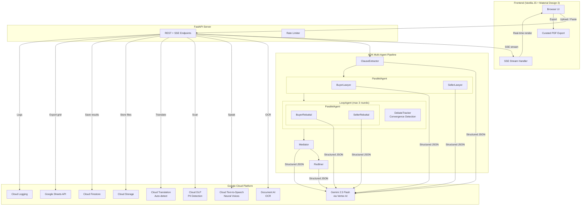

# Contract Negotiator

**Category: Agents**

A multi-agent contract analysis system where three AI lawyers — a buyer's attorney, a seller's attorney, and a neutral mediator — debate your contract in real time and deliver a structured risk assessment with suggested redlines.

Upload any contract (PDF, image, or pasted text) in any language. The system extracts clauses, runs dual-perspective legal analysis in parallel, conducts a 3-round adversarial debate, and produces a fairness-scored verdict with specific revision recommendations.

## Architecture



## How It Works

**1. Clause Extraction** — Document AI handles OCR for PDFs/images. Cloud Translation auto-detects non-English contracts and translates them. Cloud DLP scans for PII (SSN, credit cards, addresses). Gemini extracts structured clauses with categories.

**2. Dual Analysis** — A buyer's attorney and seller's attorney analyze all clauses **simultaneously** (ParallelAgent). Each identifies risks from their client's perspective, proposes changes, and cites legal reasoning. Output is structured JSON validated against Pydantic schemas.

**3. Adversarial Debate** — A LoopAgent runs up to 3 rounds where both sides argue **in parallel** (ParallelAgent within LoopAgent). Each round produces structured rebuttals with point-by-point counter-arguments and explicit concessions. A custom DebateTracker agent detects convergence — if both sides make concessions and raise no new concerns, the debate ends early.

**4. Verdict** — The Mediator synthesizes everything into a FinalReport: fairness score (1-10), per-clause risk items with priority levels (critical/important/minor), missing protections for each party, and a recommendation (sign as-is, negotiate, or walk away).

**5. Redlining** — The Redliner produces a clause-by-clause diff of the contract, revising only critical and important clauses with specific legal language. Unchanged clauses are preserved verbatim.

All agent outputs stream to the browser in real time via Server-Sent Events. Cloud TTS generates audio with distinct neural voices per agent. Results persist to Firestore and can be exported to Google Sheets or a curated PDF report.

## Google Cloud Products Used

| # | Product | What It Does Here |
|---|---------|-------------------|
| 1 | **Vertex AI (Gemini 2.5 Flash)** | Powers all 7 agents with structured JSON output via `output_schema` |
| 2 | **Google AI Development Kit (ADK)** | Orchestrates the multi-agent pipeline (Sequential, Parallel, Loop agents) |
| 3 | **Cloud Document AI** | OCR for PDF and image contracts with in-process SHA256 caching |
| 4 | **Cloud Text-to-Speech** | Neural voices (en-US-Neural2-A/C/D) with per-agent voice profiles |
| 5 | **Cloud DLP** | PII detection across 9 info types before analysis begins |
| 6 | **Cloud Translation** | Auto-detects language, translates non-English contracts to English |
| 7 | **Cloud Storage** | Stores uploaded documents and exported analysis JSON |
| 8 | **Cloud Firestore** | Persists analysis history (session metadata, scores, recommendations) |
| 9 | **Google Sheets API** | Exports risk matrix and summary to a shareable spreadsheet |
| 10 | **Cloud Logging** | Structured logging for all API calls, errors, and pipeline events |

## Agent Pipeline Detail

```
                           Gemini 2.5 Flash
                                 |
     ClauseExtractor ──── output_schema: ContractClauses
            |
     ┌──────┴──────┐
  BuyerLawyer    SellerLawyer     ← ParallelAgent (simultaneous)
  LawyerAnalysis  LawyerAnalysis     output_schema validated
     └──────┬──────┘
            |
     LoopAgent (max 3 rounds)
     ┌──────┴──────┐
  BuyerRebuttal  SellerRebuttal   ← ParallelAgent (simultaneous)
  Rebuttal        Rebuttal           structured points + concessions
     └──────┬──────┘
      DebateTracker               ← BaseAgent (convergence detection)
            |                        exits early if positions converge
     Mediator ──── output_schema: FinalReport
            |        fairness_score, risk_items[], recommendation
     Redliner ──── output_schema: RedlinedContract
                     clause-by-clause diff with legal revisions
```

Each agent's instruction uses a **static prefix** (legal rubric, scoring guide) followed by dynamic context (clauses, prior analyses). This pattern maximizes Vertex AI's implicit prefix caching across calls.

Debate history is **summarized** (concessions, contested points, new concerns) rather than passed as raw JSON — reducing prompt tokens by ~600-800 per round.

## Tech Stack

| Layer | Technology |
|-------|-----------|
| **AI/ML** | Gemini 2.5 Flash, Google ADK (SequentialAgent, ParallelAgent, LoopAgent, BaseAgent) |
| **Backend** | FastAPI, Uvicorn, SSE streaming, Pydantic v2 schema validation |
| **Frontend** | Vanilla JS, Material Symbols, Material Design 3 color system |
| **Storage** | Cloud Firestore, Cloud Storage, Google Sheets |
| **Processing** | Document AI (OCR), Cloud DLP (PII), Cloud Translation |
| **Audio** | Cloud Text-to-Speech (3 Neural2 voices) |
| **Security** | Rate limiting (SlowAPI), input validation, PII scanning, CORS |

## Setup

```bash
# Clone and install
git clone <repo-url> && cd ProfessorPixel
python -m venv .venv && source .venv/bin/activate
pip install -e .

# Configure (create .env in project root)
GOOGLE_CLOUD_PROJECT=your-project-id
GOOGLE_CLOUD_LOCATION=us-central1
GOOGLE_GENAI_USE_VERTEXAI=TRUE
DOCAI_PROCESSOR_ID=your-processor-id
GCS_BUCKET_NAME=your-bucket

# Run
python server.py
# Open http://localhost:8080
```

**Required GCP APIs**: Vertex AI, Document AI, Cloud Text-to-Speech, Cloud DLP, Cloud Translation, Cloud Storage, Cloud Firestore, Google Sheets, Cloud Logging.

## Project Structure

```
server.py                        FastAPI server (SSE streaming, 11 endpoints)
contract_negotiator/
  agent.py                       Root SequentialAgent pipeline
  agents/
    clause_extractor.py          Gemini agent: contract → structured clauses
    buyer_lawyer.py              Gemini agent: buyer-side risk analysis
    seller_lawyer.py             Gemini agent: seller-side risk analysis
    debate_tracker.py            LoopAgent + ParallelAgent + convergence detection
    mediator.py                  Gemini agent: balanced verdict with scoring
    redliner.py                  Gemini agent: clause-by-clause revisions
  models/schemas.py              Pydantic schemas for all agent outputs
  tools/                         GCP service integrations (TTS, DLP, DocAI, etc.)
static/
  index.html                     Single-page app
  style.css                      Material Design 3 theme (dark + light)
  app.js                         SSE handler, structured rendering, PDF export
  print.css                      Curated print report styles
```

## Performance Optimizations

- **Parallel execution**: Buyer + Seller analysis runs simultaneously; rebuttals also run in parallel within each debate round
- **Convergence detection**: Debate loop exits early when both sides make concessions and raise no new concerns (saves ~10-20s)
- **Debate history summarization**: Compact summaries instead of full JSON reduce prompt tokens by ~2,400 across 3 rounds
- **Vertex AI prefix caching**: Static instruction prefixes separated from dynamic context for implicit cache hits
- **Client pooling**: All GCP clients instantiated once and reused
- **In-process caching**: TTS (200 entries), Document AI OCR (50 entries) cached by content hash
- **Async I/O**: All blocking GCP calls run in ThreadPoolExecutor workers

## Team

Built by **Team ProfessorPixel** at the Google Cloud hackathon.
