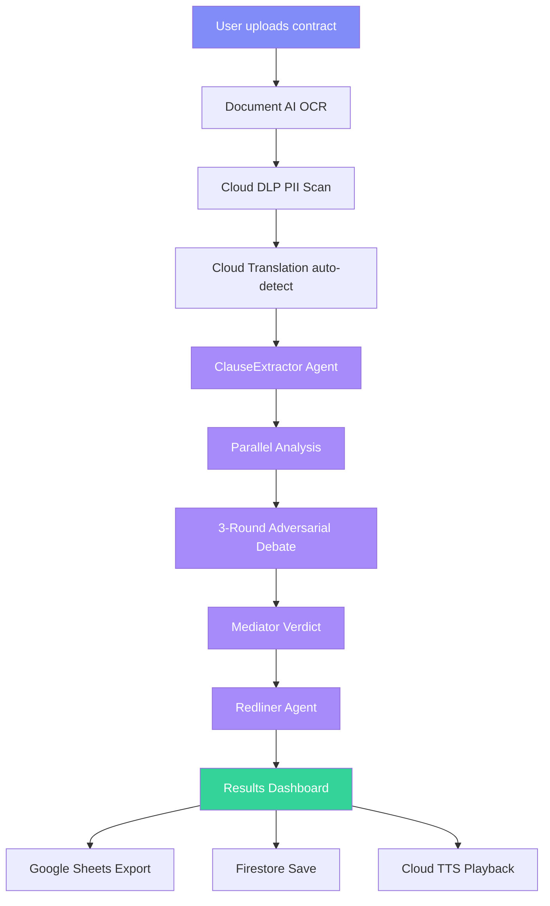
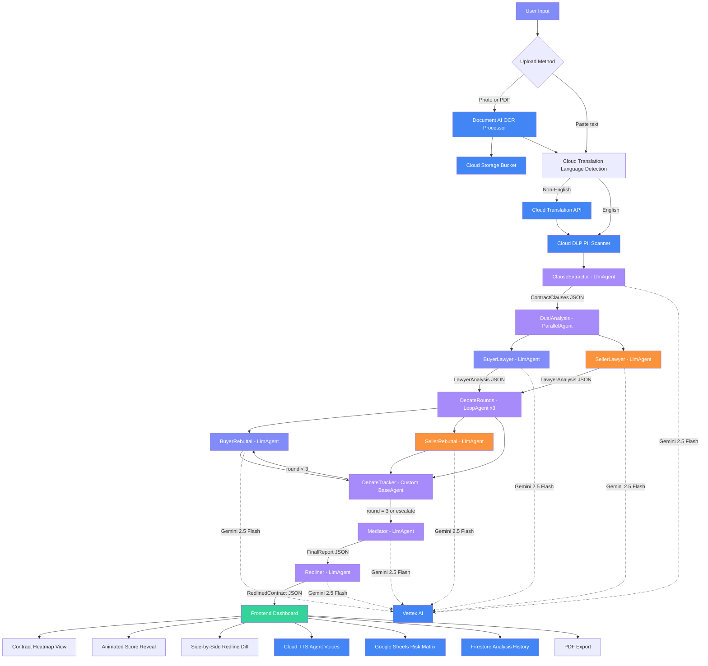
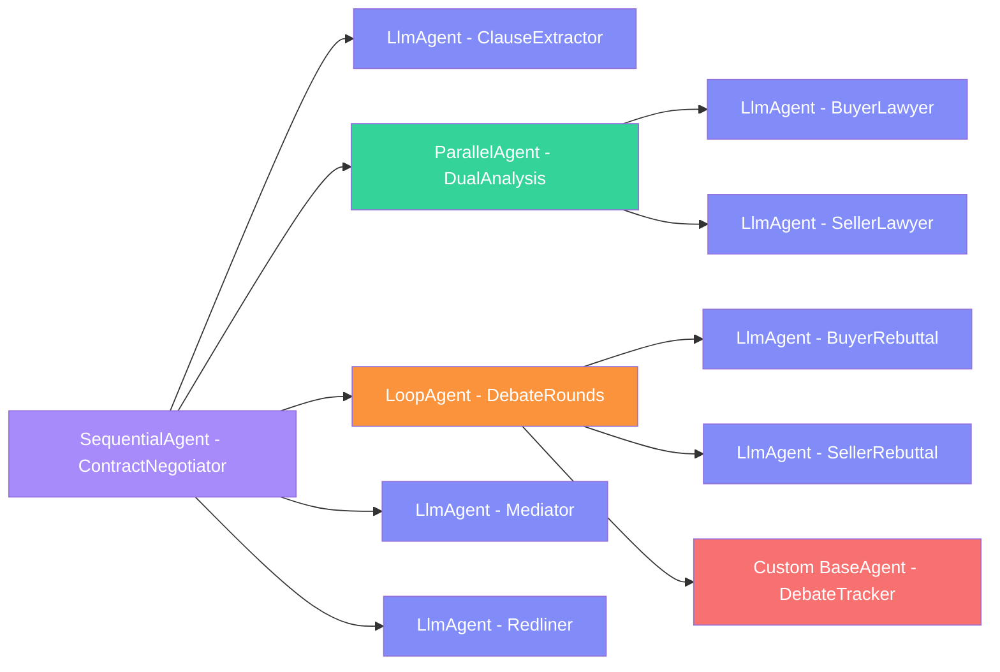
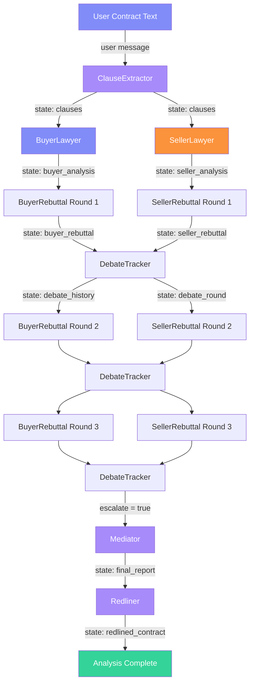

# Contract Negotiator — Architecture Diagrams

## 1. High-Level Pipeline

## 2. Detailed Agent Architecture

## 3. Google Cloud Services Map

```mermaid
graph TD
    PROJECT[GCP Project] --> AI[AI and ML]
    PROJECT --> STORAGE[Storage and Data]
    PROJECT --> INFRA[Infrastructure]
    PROJECT --> INTEGRATION[Integration]

    AI --> VERTEX[Vertex AI - Model hosting]
    AI --> GEMINI[Gemini 2.5 Flash - 7 agents]
    AI --> ADK[Agent Development Kit - Pipeline orchestration]
    AI --> DOCAI2[Document AI - Contract OCR]
    AI --> TRANS[Cloud Translation - Multi-language]
    AI --> DLPAPI[Cloud DLP - PII detection]
    AI --> TTSAPI[Cloud TTS - Agent voices]

    STORAGE --> GCS2[Cloud Storage - File uploads]
    STORAGE --> FIREDB[Firestore - Analysis history]

    INFRA --> RUN[Cloud Run - Backend hosting]
    INFRA --> FIREBASE[Firebase Hosting - Frontend]
    INFRA --> LOGGING[Cloud Logging - Observability]

    INTEGRATION --> SHEETSAPI[Google Sheets API - Risk matrix export]

    style PROJECT fill:#202124,color:#fff
    style AI fill:#a78bfa,color:#fff
    style STORAGE fill:#818cf8,color:#fff
    style INFRA fill:#34d399,color:#fff
    style INTEGRATION fill:#fb923c,color:#fff
    style VERTEX fill:#7c3aed,color:#fff
    style GEMINI fill:#7c3aed,color:#fff
    style ADK fill:#7c3aed,color:#fff
    style DOCAI2 fill:#7c3aed,color:#fff
    style TRANS fill:#7c3aed,color:#fff
    style DLPAPI fill:#7c3aed,color:#fff
    style TTSAPI fill:#7c3aed,color:#fff
    style GCS2 fill:#6366f1,color:#fff
    style FIREDB fill:#6366f1,color:#fff
    style RUN fill:#059669,color:#fff
    style FIREBASE fill:#059669,color:#fff
    style LOGGING fill:#059669,color:#fff
    style SHEETSAPI fill:#ea580c,color:#fff
```

## 4. ADK Agent Patterns Used

## 5. Data Flow and State Passing

